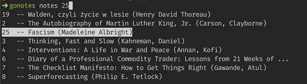

[](https://goreportcard.com/report/github.com/turbaszek/gonotes)
[](https://opensource.org/licenses/MIT)

# GoNotes
Command line tool to manage and search your Kindle clippings in an easy way!



<!-- START doctoc generated TOC please keep comment here to allow auto update -->
<!-- DON'T EDIT THIS SECTION, INSTEAD RE-RUN doctoc TO UPDATE -->
**Table of Contents**

- [Usage](#usage)
- [Help](#help)
- [Autocomplete](#autocomplete)
- [Installation](#installation)
- [Development](#development)

<!-- END doctoc generated TOC please keep comment here to allow auto update -->

## Usage
Parse your clippings files from Kindle:
```
➜ gonotes parse /path/to/your/clippings.txt
```

Then you can list notes from a book. Press tab use autocomplete
(check how to [enable](#autocomplete) it):
```
➜ gonotes notes 8  # shows notes from book with ID 8
```

You can display notes from single book and **search using grep**:
```
➜ gonotes notes 3 | grep tourism
tourism is about helping people construct stories and collect memories.
```

Remember to use [cowsay](https://en.wikipedia.org/wiki/Cowsay) to share your
favourite quotes!
```
➜ gonotes n 12 | grep "personal growth" | cowsay
 ______________________________________
/ Simply having enough money to spare  \
| converts the vicious cycle of stress |
| and poor decision making into a      |
\ virtuous cycle of personal growth.   /
 --------------------------------------
        \   ^__^
         \  (oo)\_______
            (__)\       )\/\
                ||----w |
                ||     ||
```

There's also possibility to get a random quote that will be no longer
than specified number of words
```
➜ gonotes r -q -l 15 | cowsay -f bunny
 ________________________________________
/ Hate is just as injurious to the hater \
| as it is to the hated. - The           |
| Autobiography of Martin Luther King,   |
\ Jr. (Carson, Clayborne)                /
 ----------------------------------------
  \
   \   \
        \ /\
        ( )
      .( o ).
```

## Help
<!-- AUTO_STAR -->
```
  NAME:
     gonotes - manage your Kindle notes.

     For more information check https://github.com/turbaszek/gonotes

  USAGE:
     gonotes [global options] command [command options] [arguments...]

  VERSION:
     v0.1

  COMMANDS:
     parse, p   Parses provided file and creates books and notes
     book, b    Utilities to manage books
     notes, n   List notes
     random, r  Shows a random note
     help, h    Shows a list of commands or help for one command

  GLOBAL OPTIONS:
     --help, -h     show help (default: false)
     --version, -v  print the version (default: false)
```
<!-- AUTO_END -->

## Autocomplete
To set up autocomplete including book hints run one of the following:
```
# bash
source <(gonotes completion bash)

# zsh
source <(gonotes completion zsh)
```
To persist the autocomplete behaviour add this selected option to
your `.bashrc` or `.zshrc`.

## Installation
Currently, you can install GoNotes in two ways:
- clone the repo and then `go install ./cmd/gonotes` - this will install actual master
- download the binary:
    ```
    curl -L https://github.com/turbaszek/gonotes/releases/download/v0.1/gonotes -o /usr/local/bin/gonotes && chmod +x /usr/local/bin/gonotes
    ```

## Development
Feel free to open issues and PRs. To build the project follow are usuall go steps. Consider using
[pre-commits](https://pre-commit.com) for static checks and code formatting. On Mac this should do:
```
brew install pre-commit
pre-commit install
```
